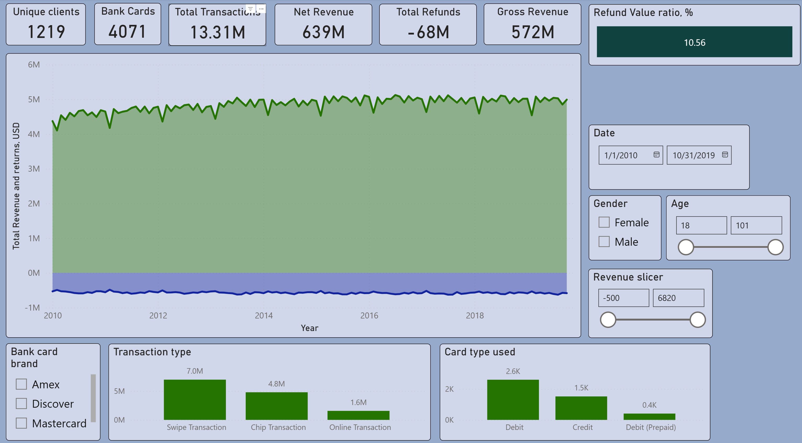
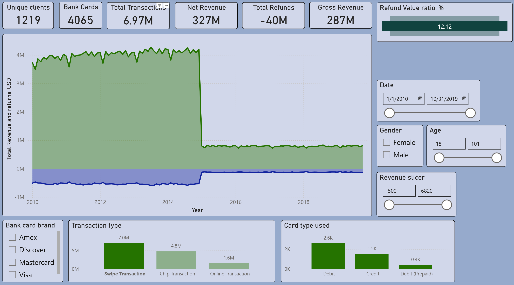
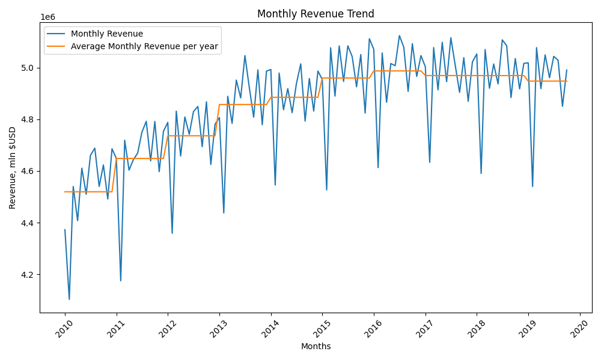

# Financial Transactions EDA: Revenue, Refunds, Customer Segmentation & Payment Anomaly Analysis

## Project Summary
This project analyzes approximately 13 million financial transactions to examine revenue seasonality, customer revenue concentration, refund behavior, and fraud-related anomalies.

Using MySQL, Python, and Power BI, I cleaned and explored the data, built time-based and customer-level analyses, and identified patterns with practical implications for retention, operational monitoring, and payment-control review.

## Business Questions
- How does revenue change over time?
- Are there seasonal or monthly patterns in sales?
- Which customers contribute most of the revenue?
- How do refunds relate to active customer trends?
- Are there suspicious transactions, such as payments after card expiration?

## Key Findings & Insights

### Key Findings

- Dataset period: 2010-01-01 to 2019-10-31.
- Total transactions: 13M+.
- Total clients: 2,000; Among whom: active clients - 1,219 and inactive clients - 781.
- Total gross revenue: ~$639M.
- Total refunds: ~$67.5M.
- Total net revenue: ~$571M.
- Refund and anomaly patterns suggest areas for operational and payment-control review.

### Key Insights

| Analysis Area | Key Insight | Business Relevance |
|---|---|---|
| Revenue Trends | Revenue shows monthly and seasonal variation | Supports forecasting and campaign timing |
| Customer Revenue | A small share of customers drives a large share of revenue | Highlights retention risk |
| Refund Activity | Refund spikes are concentrated in specific periods | Suggests operational review points |
| Payment Anomalies | Some transactions occur after card expiration | Indicates control or data-quality issues |

## Business Impact

This project shows how transaction-level financial data can support revenue monitoring, refund control, customer retention, and payment-risk review.

- **Revenue monitoring:** Monthly revenue trends help identify seasonality, unusual drops, and forecasting opportunities.
- **Refund control:** Refund analysis highlights potential revenue leakage and periods that may require operational review.
- **Customer retention:** Customer segmentation helps identify high-value clients and inactive users for targeted retention actions.
- **Payment-risk review:** Anomaly checks, including transactions after card expiration, can support fraud, compliance, or data-quality investigation.
- **Executive reporting:** The Power BI dashboard makes revenue and refund insights accessible to non-technical stakeholders.

Overall, the project demonstrates how SQL, Python, and Power BI can turn raw financial transaction data into actionable insights for finance, operations, and risk teams.

## Business Recommendations
- Monitor revenue seasonality to improve planning and campaign timing.
- Investigate refund spikes by product, region, or operational process.
- Build retention strategies for high-value customers.
- Review payment validation rules for transactions involving expired cards.

## Limitations
- The analysis is based on the available synthetic dataset and may not reflect missing external business context.
- Suspicious transaction patterns are indicators, not proof of fraud.
- Some findings may require product, region, or channel-level breakdown for deeper interpretation.

## Tools Used
- MySQL
- Python
- pandas
- matplotlib
- seaborn
- SQLAlchemy
- Power BI

## Project Deliverables
- SQL analysis scripts
- Python visualization scripts and exported charts
- Dashboard screenshots / Power BI reporting

## Methodology

### Phase 1 - Data Understanding and Preparation
**Goal:** Understand the dataset structure and prepare the data for analysis in MySQL.  
**Tasks completed:**
- validated table structure and column definitions
- reviewed key fields and relationships
- checked for nulls and general data consistency
- collected overall dataset statistics, including:
  - total clients, cards, and transactions
  - total time period covered by the dataset
  - total revenue, refunds, and net revenue
- cleaned and standardized the data for further analysis

### Phase 2 - Time-Based Analysis
**Goal:** Analyze how revenue and refunds change over time, including trend, seasonality, volatility, and customer activity patterns.  
**Techniques used:**
- aggregations and conditional aggregations
- date transformations and time-based grouping
- window functions for month-over-month and rolling calculations
- trend and seasonality analysis
- refund ratio and volatility analysis
- customer activity metrics, including revenue per active client and card

### Phase 3 - Customer Behavior and Revenue Structure
**Goal:** Understand how revenue is distributed across customers and how customer purchase behavior differs across segments.  
**Techniques used:**
- customer ranking and revenue concentration analysis
- contribution analysis for top customers
- purchase frequency and order-volume segmentation
- average time-between-purchase analysis
- revenue-versus-frequency matrix segmentation
- refund ratio analysis at the customer level

### Phase 4 - Payment Risk and Anomaly Analysis
**Goal:** Identify suspicious patterns, data integrity issues, and unusual card or customer behavior that may require further investigation.  
**Focus areas:**
- cards flagged on the dark web
- duplicate card numbers and possible card-sharing patterns
- cards without clients or transactions
- clients without recorded transactions
- transactions after card expiration dates
- unusual client reactivation after long inactivity periods

## Dashboard & Data Visualization
An interactive Power BI dashboard was developed to present key financial metrics, revenue trends, refund behavior, and customer activity insights.

### Dashboard Preview

This dashboard summarizes revenue, refunds, customer activity, and key financial trends for business users.



The same dashboard showing changes when only Swipe transactions were selected. Note: Introducing contactless payments became significantly more popular since 2014.



### Interactive File
The Power BI `.pbix` file is available here: [Download dashboard](https://drive.google.com/file/d/13Y9dMno-slzWZmO0NdS4wKluUBi3tLQU/view?usp=sharing)

*To explore the dashboard, download and open it in Power BI Desktop.*

### Data Visualization Preview

This visualization highlights the monthly revenue trend and makes recurring seasonal variation easier to interpret.



## Repository Structure
```text
finance-eda-sales-analysis/
├── README.md
├── requirements.txt
├── .gitignore
├── data/
│   ├── sql/
│   ├── src/
│   ├── images/
│   └── dashboards/
```

### Folder Details
- `data/sql/` - SQL scripts used for transformations and analysis
- `data/src/` - Python scripts for database extraction and plotting
- `data/images/` - Exported charts used in the README and reporting
- `data/dashboards/` - Power BI dashboard screenshots or files

## How to Run This Project

### 1. Clone the repository

```bash
git clone https://github.com/NikolayKotovanalytics/finance-eda-sales-analysis.git
cd finance-eda-sales-analysis
```

### 2. Create and activate a virtual environment

**Windows**
```bash
python -m venv venv
venv\Scripts\activate
```

**macOS / Linux**
```bash
python -m venv venv
source venv/bin/activate
```

### 3. Install project dependencies

```bash
pip install -r requirements.txt
```

### 4. Download the dataset

This project uses the public **Transactions Fraud Dataset** from Kaggle.

Download it from Kaggle at: [Transactions Fraud Dataset](https://www.kaggle.com/datasets/computingvictor/transactions-fraud-datasets)

Raw data is not included in this repository due to size and licensing constraints.

See `/data/dataset_description.md` for full dataset schema and details.

### 5. Create the MySQL database and import the dataset tables

```sql
CREATE DATABASE financial_transactions_dataset;
```
Then import the dataset tables into that database.

### 6. Configure database credentials

Create a `.env` file in the project root:

```env
DB_HOST=localhost
DB_PORT=3306
DB_NAME=financial_transactions_dataset
DB_USER=your_username
DB_PASSWORD=your_password
```

### 7. Run scripts and review outputs

- SQL analysis scripts: `data/sql/`

Recommended order:
1. `phase_1_understand_data.sql`
2. `phase_2_time_based_analysis.sql`
3. `phase_3_customer_behavior_and_revenue_structure.sql`
4. `phase_4_fraud_and_anomaly_analysis.sql`
 
After the database is set up, run the Python scripts in `data/src/` to generate charts:

```bash
python data/src/phase2_monthly_revenue.py
python data/src/phase2_refunds_active_customers.py
```
- Visualizations: `data/images/` 

## Acknowledgements / AI Assistance
AI tools such as ChatGPT (OpenAI) were used for code review, debugging, and documentation refinement. All analysis design, interpretation of results, and final implementation decisions were performed by the author.
